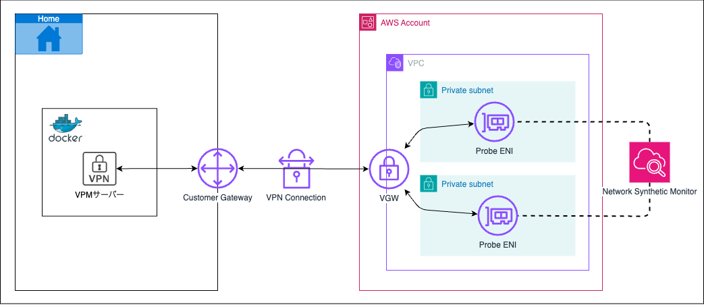

# network-synthetic-monitor-vpn

Network Synthetic Monitorを使ってみるサンプルリポジトリです。  
AWS Site to Site VPN経由の通信を対象とし、対向先のオンプレミスリソースを監視します。

## 構成図



## 動作環境

- Terraform v1.10.0
- Docker 28.0.4
- Docker Compose 2.35.0

## 構築手順

### 1.クラウドリソース構築

#### Terraform実行

Terraform内で参照する値を設定します。

* DOCKER_CIDR：Dockerコンテナで利用するネットワークCIDR
* STRONGSWAN_IP：VPNサーバーで利用するIPアドレス

```
DOCKER_CIDR=192.168.56.0/24
STRONGSWAN_IP=192.168.56.100
```

```
cd terraform;
cat <<EOF > terraform.tfvars
on_premises_cidr=$DOCKER_CIDR
monitoring_target_ip=$STRONGSWAN_IP
EOF
```

Terraformを実行します。

```
terraform init;
terraform apply;
```

* VPN シークレット確認

VPNサーバーの設定に利用するシークレットを確認します。

```
terraform output -json;
```

### 2.VPN接続設定

#### 設定ファイル

VPNサーバーの設定ファイルを作成します。

```
mkdir ./docker/conf
```

環境変数をそれぞれ設定します。

* HOME_GLOBAL_IP：オンプレミス側のグローバルIPアドレス
* AWS_CIDR_BLOCK：VPCのIP CIDR
* AWS_VPN_GLOBAL_IP_1：Site to Site VPNのトンネルのグローバルIPアドレス(1)
* AWS_VPN_GLOBAL_IP_2：Site to Site VPNのトンネルのグローバルIPアドレス(2)
* PRE_SHARED_KEY_1：Site to Site VPNのトンネルの事前共有キー (PSK) (1)
* PRE_SHARED_KEY_2：Site to Site VPNのトンネルの事前共有キー (PSK) (2)

```
DOCKER_CIDR=192.168.56.0/24
STRONGSWAN_IP=192.168.56.100
HOME_GLOBAL_IP=XXX.XXX.XXX.XXX
AWS_CIDR_BLOCK=XXX.XXX.XXX.XXX
AWS_VPN_GLOBAL_IP_1=XXX.XXX.XXX.XXX
AWS_VPN_GLOBAL_IP_2=XXX.XXX.XXX.XXX
PRE_SHARED_KEY_1=XXXXXXXXX-XXXXXXXXX
PRE_SHARED_KEY_2=XXXXXXXXX-XXXXXXXXX
```

設定ファイルをそれぞれ作成します。

* ./docker/.env

```
cat <<EOF > ./docker/.env
DOCKER_CIDR=$DOCKER_CIDR
STRONGSWAN_IP=$STRONGSWAN_IP
EOF
```

* ./docker/conf/ipsec.conf

```
cat <<EOF > ./docker/conf/ipsec.conf
config setup
    charondebug="ike 2, knl 2, cfg 2"

conn aws-tunnel1
    type=tunnel
    auto=start
    keyexchange=ikev2
    authby=psk
    leftid=$HOME_GLOBAL_IP
    leftsubnet=$DOCKER_CIDR
    right=$AWS_VPN_GLOBAL_IP_1
    rightsubnet=$AWS_CIDR_BLOCK
    aggressive=no
    ikelifetime=28800s
    lifetime=3600s
    margintime=270s
    rekey=yes
    rekeyfuzz=100%
    fragmentation=yes
    replay_window=1024
    dpddelay=30s
    dpdtimeout=120s
    dpdaction=restart
    ike=aes128-sha1-modp1024
    esp=aes128-sha1-modp1024
    keyingtries=%forever

conn aws-tunnel2
    type=tunnel
    auto=start
    keyexchange=ikev2
    authby=psk
    leftid=$HOME_GLOBAL_IP
    leftsubnet=$DOCKER_CIDR
    right=$AWS_VPN_GLOBAL_IP_2
    rightsubnet=$AWS_CIDR_BLOCK
    aggressive=no
    ikelifetime=28800s
    lifetime=3600s
    margintime=270s
    rekey=yes
    rekeyfuzz=100%
    fragmentation=yes
    replay_window=1024
    dpddelay=30s
    dpdtimeout=120s
    dpdaction=restart
    ike=aes128-sha1-modp1024
    esp=aes128-sha1-modp1024
    keyingtries=%forever
EOF
```

* ./docker/conf/ipsec.secrets

```
cat <<EOF > ./docker/conf/ipsec.secrets
$HOME_GLOBAL_IP $AWS_VPN_GLOBAL_IP_1 : PSK $PRE_SHARED_KEY_1
$HOME_GLOBAL_IP $AWS_VPN_GLOBAL_IP_2 : PSK $PRE_SHARED_KEY_2
EOF
```

####  コンテナ 実行

以下コマンドでVPNサーバーを立ち上げます。

```
cd ./docker
docker-compose up --build -d
```

以下コマンドでVPNサーバーのステータスを確認します。

```
docker exec -it strongswan /bin/bash ipsec status
```
